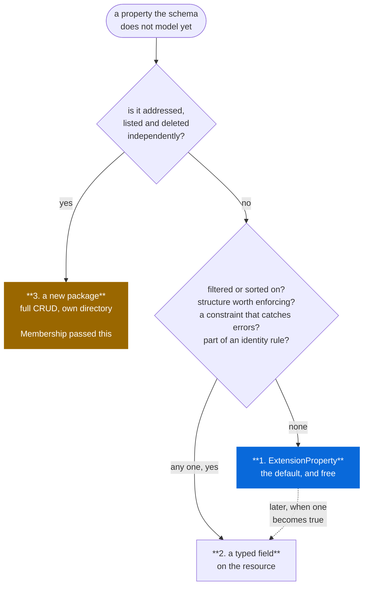

# Adding data

How anything new enters the schema. Read this before proposing a field.

## The three routes

Start at the bottom, not the top. `ExtensionProperty` costs nothing and loses
nothing, a typed field costs a schema change, and a package is a permanent
CRUD commitment — so the question is never "does this deserve a field" but
"has this earned its way out of extensions". The dotted arrow is the only
cheap move: promotion is additive, demotion breaks consumers.

Note what is absent from the decision: whether the RFC lists the property.
That is not a route to anything.

**1. `ExtensionProperty` — the default, and free.**

Every property-bearing resource carries `repeated ExtensionProperty
extensions`. Anything the schema does not model goes here, key/values/
parameters, preserved verbatim.

This is not a hole punched in a typed schema. RFC 6350 §6.10 and RFC 5545
§3.8.8.1–2 define exactly this mechanism, and 5545 *requires* applications to
ignore unrecognised properties rather than reject them. A codec that drops
them is non-conforming, so the field is mandatory whichever way you look at it.

Consequence: **no property is ever blocked on us modelling it.** A consumer
with a `GEO` or an `X-ABLabel` is unblocked today.

**2. A typed field — when the data must be queried or validated.**

Promote out of `extensions` when, and only when, one of these is true:

- something filters or sorts on it (`AIP-160` cannot see inside `extensions`)
- it has structure worth enforcing — `Recurrence` earned this; a free-text
  `NOTE` never will
- a `buf.validate` constraint would catch real errors
- it participates in a uniqueness or identity rule

"The RFC lists it" is not on that list. RFC 6350 defines ~40 properties and
this schema models 9; the other 31 are not missing, they are in `extensions`.

**3. A new package — when the thing has identity.**

Its own `protobuf/<rfc>/<resource>/v1/`, with the full CRUD surface. The test
is whether it is addressed, listed and deleted independently. `Membership`
passed; `Alarm` failed and is a value object on `Event`.

## Graduating a property

1. Add the typed field.
2. Codecs write it to the typed field and stop emitting it into `extensions`.
3. Readers tolerate both for one version — old rows still carry it in
   `extensions`.

Step 3 is why promotion is cheap and demotion is not. Adding a typed field
never breaks a consumer; removing one does.

## Before defining a value type: check googleapis

`docs/references.md` has the links. `google/type` is the obvious place, but
the survey turned up three more areas worth knowing:

| Area | Status |
|---|---|
| `google/rpc` | **adopted** — `ImportFailure.status` is a `google.rpc.Status`, so a failed entry carries a `google.rpc.Code` and can hold a `BadRequest.FieldViolation` naming the field and constraint. A protovalidate failure maps onto that exactly. |
| `google/longrunning` | adopted — `Operation` on both `Interchange` methods |
| `google/api` | adopted — `field_behavior`, `resource`, `http`, `field_info`, `client` |
| `google/iam` | not applicable — this schema has no policy surface |

Unused but worth remembering: `api/httpbody.proto` carries arbitrary content
plus a media type, which is an alternative shape for the interchange payload
if the output-URI approach ever proves awkward; `api/launch_stage.proto`
marks a package alpha or beta; `rpc/code.proto` is the canonical list the
service comments already name.

## `google/type` specifically

`google.*` is the only exemption to the cross-package ban, so `google.type`
is the one place a structured value type can be shared rather than copied
into every package. Adopted so far:

| Type | Used for | Instead of |
|---|---|---|
| `DayOfWeek` | `WeekdayNum.day`, `Recurrence.week_start` | a `Weekday` enum of our own, now deleted |
| `Month` | `Recurrence.months` | `repeated int32` with a 1-12 constraint |
| `TimeZone` | `Calendar.time_zone` | a string with an IANA-shaped regex; this also carries the tzdata version |
| `Date` (via `DateOrText`) | `Contact.birthday`/`anniversary`, `BDAY` §6.2.5 / `ANNIVERSARY` §6.2.6 | year 0 means "no year", which is the common case in address books and which `Timestamp` cannot express |
| `LatLng` | `Event.position`, `GEO` §3.8.1.6 | fits iCalendar's `lat;lon` exactly; vCard's §6.5.2 is a `geo:` URI and needs parsing first -- still queued there |
| `Interval` | `ExpandEventRequest.window`, `QueryFreeBusyRequest.window` | a request-scoped time window, not a resource field -- rejected for `Event` itself, see below |

| Type | For | Why not |
|---|---|---|
| `PostalAddress` | `Contact.Address` | models `address_lines` plus region/administrative area; RFC 6350 §6.3.1 is seven fixed multi-valued components. Mapping loses component identity and round-trips lossily |
| `PhoneNumber` | `Contact.Telephone` | models E.164 plus short code; §6.4.1 explicitly permits free-text values, which this would reject |
| `Interval` | `Event` start/end | start/end only; §3.6.1 permits DTEND **or** DURATION, and the oneof already enforces that |
| `LocalizedText` | `display_names`, `descriptions` | vCard and LDAP carry multi-valued properties with a `LANGUAGE` parameter, not one string plus one tag. Would need `repeated LocalizedText` *and* still lose the other parameters |
| `CalendarPeriod` | `Recurrence.frequency` | DAY/WEEK/MONTH/QUARTER — no SECONDLY, MINUTELY or HOURLY, and it has FORTNIGHT and HALF which RRULE has no concept of |
| `TimeOfDay` | — | nothing in these RFCs is a wall-clock time divorced from a date |
| `Decimal`, `Money`, `Fraction`, `Color`, `Quaternion`, `Expr` | — | no field in any of these RFCs is a number of that kind |

Fidelity to the RFC outranks reuse. That is the tie-break, and it is why the
first two are rejected despite looking like obvious matches.

## What is queued

Nothing here is blocked. Each waits on a consumer that needs it typed.

| Candidate | RFC | Why it might graduate |
|---|---|---|
| `GEO` §6.5.2 coordinates | 6350 | the property itself is done as `Contact.locations` (`Geo.value`, still a `geo:` URI string); parsing it into `LatLng` **still queued** -- iCalendar's §3.8.1.6 is done as `Event.position` because it is already a lat;lon pair, no parsing needed |
| `CATEGORIES` §3.8.1.2 on `Event`/`Todo`/`Journal` | 5545 | vCard's is done, flat on `Contact`; iCalendar's is still queued |
| `GEO` §3.8.1.6 on `Todo` | 5545 | permitted on VTODO too; typed on `Event` only so far |
| `ATTACH` §3.8.1.1 | 5545 | large; wants a sub-resource, not a field |
| `PHOTO` §6.2.4, `KEY` §6.8.1 | 6350 | large; inline base64 would bloat every `ListVcards` page. Architecture already decided -- an `Avatar`/credential sub-resource, not a field -- see `decisions.md`'s "Deliberately not planned" |
| `RRULE` on `Todo` | 5545 | recurring todos; forces the duplication tax in `decisions.md` |
| `ATTENDEE` on `Todo`/`Journal` | 5545 | same duplication cost |
| `SOURCE` §6.1.3, `GENDER` §6.2.7, GEO parameters, `LOGO` §6.6.3, `SOUND` §6.7.5, `CLIENTPIDMAP` §6.7.7, `FBURL` §6.9.1, `CALADRURI` §6.9.2, `CALURI` §6.9.3 | 6350 | no consumer has asked; `PRODID`/`REV` are arguably already covered -- `REV` is `update_time`, `PRODID` describes the exporter, not the contact |
| `telephoneNumber` §2.35, `l` §2.16, `st` §2.33, `street` §2.34, `postalCode` §2.24 | 4519 | on `Organization` and `OrganizationalUnit`; together they restate `Contact.Address` from `rfc6350/v1`, which rule 4 forbids sharing, so add only when actually needed |

## What still needs building, not just typing

Nothing currently. CalDAV, CardDAV and `OrganizationalUnit` were the last
three; what remains of RFC 4519 is either in "what is queued" above or in
`decisions.md`'s "Deliberately not planned" (`person`, `country`,
`locality`, `groupOfUniqueNames`).

All five codecs are built, so a round trip is the acceptance test for
everything above rather than a thing to build. What the codecs caught is in
[`codec-findings.md`](codec-findings.md).
