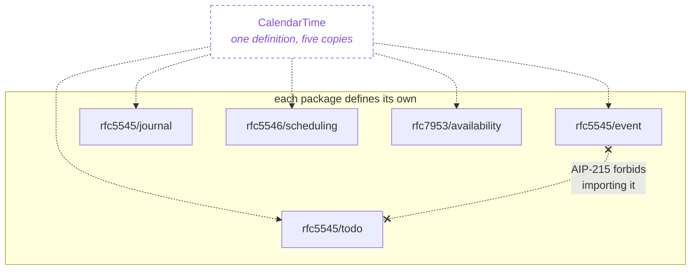

# Decisions

What was decided and deliberately not built, kept because the schemas cite it.
`CLAUDE.md` and `docs/conventions.md` hold the rules; this holds the
consequences of applying them.

It is not a roadmap. The roadmap was `PLAN.md` and `plan/`, and both were
deleted when the last plan landed -- a finished plan is removed rather than
marked DONE, which is the convention those files themselves set.

## Deliberately not built

- **A SCIM-to-LDAP codec.** The contact lineage has RFC 9555, which maps vCard
  to JSContact element by element, so `runtime-go/rfc` follows a
  specification. **Nothing equivalent exists for SCIM and LDAP.** Writing one
  means inventing the mapping, which rule 14 permits only with every message
  saying so -- real design work with real choices, not a translation. Until
  someone needs it, the identity lineage has two models and no conversion, and
  that is stated rather than papered over.
- **RFC 9253's GAP parameter.** It attaches to RELATED-TO, and RELATED-TO is
  not modelled on components -- only `Alarm.snoozed_alarm_uid` uses that
  property, for the SNOOZE relation. GAP has nothing to attach to yet.
- **RFC 9554's PROP-ID, DERIVED and AUTHOR parameters.** They exist to make
  JSContact conversion lossless, and the conversion works without them. Add
  them when a round trip is shown to drop something they would have carried.
- **JSContact `localizations` (RFC 9553 section 2.7.1).** Typed
  `String[PatchObject]` -- a JSON-patch structure with no natural protobuf
  shape. It needs its own decision, not a guess.
- **RFC 9967, SCIM security event tokens.** A notification protocol rather
  than schema: it defines events a provider emits, which is a service concern
  and not a resource this repository would model.

- **JSCalendar, RFC 8984.** The canonical calendar model under rule 14, and
  deferred anyway. JSCalendar 2.0 obsoletes 8984 and has sat in IESG review
  for months without a number; the iCalendar↔JSCalendar conversion is also
  still a draft. Building 8984 now would ship a `v1` of a spec superseded
  before it landed. **Trigger: build when jscalendarbis is published**, to
  2.0, skipping 8984 entirely. Until then iCalendar is both the model and
  the format, and `docs/ontology.md` says so.

- **VTIMEZONE (§3.6.5).** Modelling a timezone database in protobuf when IANA
  publishes one, and `google.type.TimeZone` already carries the id and the
  tzdata version.
- **CalDAV capability negotiation, RFC 4791 §5.2.3-4**
  (`supported-calendar-component-set`, `supported-calendar-data`). What a
  collection *accepts*, as opposed to the limits it enforces. A resource
  calendar takes VEVENT and nothing else, which an adapter answers statically,
  so neither has earned a field. The four limits from §5.2.5-9 are built, on
  `Calendar` as `max_resource_size`, `min_date_time`, `max_date_time`,
  `max_instances` and `max_attendees_per_instance`.
- **WebDAV ACL and `CALDAV:read-free-busy`, RFC 3744 / RFC 4791 §6.1.** A
  generic permissions framework, not calendar data, and RFC 3744 is not in
  this schema's RFC list.
- **addressbook-multiget, RFC 6352 §8.7.** Repeated `GetVcard` today. Its
  calendar twin, `calendar-multiget` §7.9, has since been built as
  `Events.BatchGetEvents` because a CalDAV consumer needed the round trips;
  no consumer has asked the same of the address book, so this one waits.
- **PHOTO (§6.2.4) and KEY (§6.8.1) as fields.** Both are URI-valued, no
  different in shape from `Url` or `Geo` -- the risk is a `data:` URI
  embedding a full base64 blob inline, bloating every `ListVcards` page.
  Decided: each becomes its own sub-resource under `Vcard` when built (an
  `Avatar` for PHOTO, a separate credential resource for KEY, each with full
  AIP-131..135 CRUD), not AIP-157 partial responses, which would add
  `read_mask` plumbing across the whole service for two properties. Not
  built: no consumer yet, and a sub-resource is a real CRUD commitment
  (rule 8) for either one.
- **The remaining 40-odd RFC 4519 attribute types.** Adding them because they
  exist is exactly what rule 13 forbids.
- **`person` (§3.12) and `organizationalPerson` (§3.9).** `person` carries
  `sn`, `cn`, `userPassword`, `telephoneNumber`, `seeAlso`, `description` --
  a worse `Contact` than RFC 6350 already gives, and `Vcard` in `rfc6350/vcard/v1`
  already occupies the "addressable person" slot. A second person resource
  with no rule for choosing between them is worse than not having one; if
  LDAP-sourced people need representing, map them onto `Vcard` in the codec.
- **`country` (§3.2) and `locality` (§3.7) as resources.** `country` has one
  mandatory attribute (`c`, a two-letter ISO 3166 code) and `locality` has
  none. Neither has identity worth managing through CRUD -- a country is a
  value, not a resource. If a country code is needed it is a documented
  `string` field per rule 4, the same argument that removed the primitives
  layer.
- **`groupOfUniqueNames` (§3.6).** `Membership`'s own comment documents why:
  `uniqueMember` (§2.40) appends a UID to a DN so a reused name does not
  inherit an old membership, and `Membership.uid` solves that more directly.
- **A published codec library.** `codec/go` is a conformance test and says so
  in its own module comment. Turning it into a product is a different project
  with a different support burden.

## The AIP-215 duplication tax

The dashed box is not a package — it is the type that *would* exist if one
were allowed. What exists is five identical definitions, and the crossed edge
is the import that would remove them.

`CalendarTime` is defined identically four times (`rfc5545/event`, `todo`,
`journal`, `rfc5546/scheduling`); `Classification` and `Participation` are
each duplicated too. One package per resource plus AIP-215's cross-package
ban means any value type shared between iCalendar components must be copied
per package -- `Recurrence`, `Attendee`, `Organizer` and `Alarm` are
deliberately *not* on `Todo` for the same reason.

Two ways out when a consumer forces the issue, neither free: copy the type
into each package that needs it (simple, but every codec then treats e.g.
`event.v1.Classification` and `todo.v1.Classification` as distinct types that
happen to agree), or collapse `rfc5545` into one package holding every
component (removes the duplication, breaks one-resource-per-package
independent versioning). Decide when something actually needs recurring
todos, not before.

## Open

Everything the plans covered is built. What remains is either a decision
nobody has needed to make yet or a consequence of work moving between
repositories.

- **`protobufrfc.dev`** is the resource-type prefix on all fourteen
  `google.api.resource` declarations and is a placeholder domain. Cheap to
  change now; a breaking change once a consumer depends on the type strings.
- **Four committed files reference documents that are moving out.**
  `CLAUDE.md` line 183 *imports* `docs/ontology.md`, which is rule 14 itself;
  `README.md` and `docs/conventions.md` point at `PLAN.md` and `plan/`. Those
  break on a fresh clone until the documents land somewhere. Separately,
  `docs/references.md` still points at `plan/07-adding-data.md`, which is now
  `docs/adding-data.md` and has been stale for longer.
- **The AIP-215 duplication tax** (`CalendarTime` copied five times,
  `Classification` and `Participation` twice each) is unresolved by design --
  see the duplication tax above.

Two items that were open are not any more, recorded so they are not
rediscovered: `BUF_TOKEN` is set and `PublishModule` runs, which is where the
BSR module `runtime-go/rfc` depends on comes from; and the message-level CEL
rules are now executed, by `Validate()` in that module -- they had never been
run by anything, because `buf build`, `buf lint` and api-linter all pass on a
broken CEL expression.
