# Protobuf RFC Reference

> [!IMPORTANT]
> Auto-generated by `protodoc`. Do not edit manually.

Every protobuf module under `protobuf/`. Each row links to that module's generated reference.

## Modules

| Module | Package | Services | Messages | Enums | Reference |
| --- | --- | --- | --- | --- | --- |
| Group | `protobuf.rfc4519.group.v1` | 1 | 8 | 0 | [README](rfc4519/group/README.md) |
| Membership | `protobuf.rfc4519.membership.v1` | 1 | 7 | 0 | [README](rfc4519/membership/README.md) |
| Organization | `protobuf.rfc4519.organization.v1` | 1 | 8 | 0 | [README](rfc4519/organization/README.md) |
| Organizational Unit | `protobuf.rfc4519.organizational_unit.v1` | 1 | 8 | 0 | [README](rfc4519/organizational_unit/README.md) |
| Calendar | `protobuf.rfc5545.calendar.v1` | 1 | 12 | 2 | [README](rfc5545/calendar/README.md) |
| Event | `protobuf.rfc5545.event.v1` | 1 | 25 | 12 | [README](rfc5545/event/README.md) |
| Journal | `protobuf.rfc5545.journal.v1` | 1 | 10 | 2 | [README](rfc5545/journal/README.md) |
| Todo | `protobuf.rfc5545.todo.v1` | 1 | 10 | 2 | [README](rfc5545/todo/README.md) |
| Scheduling | `protobuf.rfc5546.scheduling.v1` | 2 | 19 | 1 | [README](rfc5546/scheduling/README.md) |
| Vcard | `protobuf.rfc6350.vcard.v1` | 1 | 27 | 6 | [README](rfc6350/vcard/README.md) |
| Group | `protobuf.rfc7643.group.v1` | 1 | 9 | 0 | [README](rfc7643/group/README.md) |
| User | `protobuf.rfc7643.user.v1` | 1 | 13 | 0 | [README](rfc7643/user/README.md) |
| Availability | `protobuf.rfc7953.availability.v1` | 1 | 11 | 1 | [README](rfc7953/availability/README.md) |
| Resource | `protobuf.rfc9073.resource.v1` | 1 | 9 | 0 | [README](rfc9073/resource/README.md) |
| Card | `protobuf.rfc9553.card.v1` | 1 | 34 | 16 | [README](rfc9553/card/README.md) |
| Interchange | `protobuf.shared.interchange.v1` | 1 | 10 | 0 | [README](shared/interchange/README.md) |
| Project | `protobuf.shared.project.v1` | 1 | 8 | 1 | [README](shared/project/README.md) |
| Search | `protobuf.shared.search.v1` | 1 | 3 | 0 | [README](shared/search/README.md) |
| Sync | `protobuf.shared.sync.v1` | 1 | 3 | 1 | [README](shared/sync/README.md) |
| **Total** | _19 modules_ | 20 | 234 | 44 | |

## Dependency graph

Import relationships between modules in this repository. External dependencies (`google.*`, `buf.*`) are omitted.

```mermaid
graph LR
    protobuf_rfc4519_group_v1["Group<br/>protobuf.rfc4519.group.v1"]
    protobuf_rfc4519_membership_v1["Membership<br/>protobuf.rfc4519.membership.v1"]
    protobuf_rfc4519_organization_v1["Organization<br/>protobuf.rfc4519.organization.v1"]
    protobuf_rfc4519_organizational_unit_v1["Organizational Unit<br/>protobuf.rfc4519.organizational_unit.v1"]
    protobuf_rfc5545_calendar_v1["Calendar<br/>protobuf.rfc5545.calendar.v1"]
    protobuf_rfc5545_event_v1["Event<br/>protobuf.rfc5545.event.v1"]
    protobuf_rfc5545_journal_v1["Journal<br/>protobuf.rfc5545.journal.v1"]
    protobuf_rfc5545_todo_v1["Todo<br/>protobuf.rfc5545.todo.v1"]
    protobuf_rfc5546_scheduling_v1["Scheduling<br/>protobuf.rfc5546.scheduling.v1"]
    protobuf_rfc6350_vcard_v1["Vcard<br/>protobuf.rfc6350.vcard.v1"]
    protobuf_rfc7643_group_v1["Group<br/>protobuf.rfc7643.group.v1"]
    protobuf_rfc7643_user_v1["User<br/>protobuf.rfc7643.user.v1"]
    protobuf_rfc7953_availability_v1["Availability<br/>protobuf.rfc7953.availability.v1"]
    protobuf_rfc9073_resource_v1["Resource<br/>protobuf.rfc9073.resource.v1"]
    protobuf_rfc9553_card_v1["Card<br/>protobuf.rfc9553.card.v1"]
    protobuf_shared_interchange_v1["Interchange<br/>protobuf.shared.interchange.v1"]
    protobuf_shared_project_v1["Project<br/>protobuf.shared.project.v1"]
    protobuf_shared_search_v1["Search<br/>protobuf.shared.search.v1"]
    protobuf_shared_sync_v1["Sync<br/>protobuf.shared.sync.v1"]
    %% no local cross-module imports
```

---

© 2026 The Protobuf Project Authors | Apache 2.0 License
